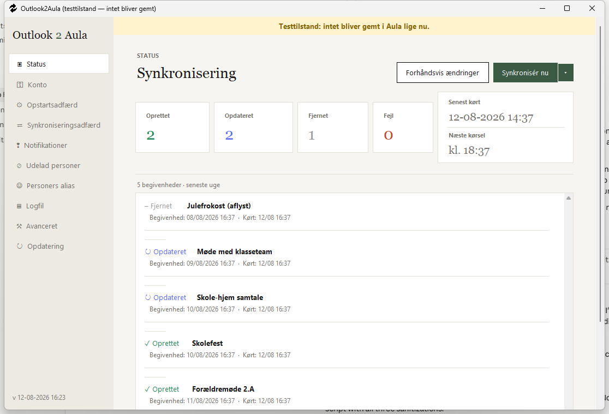
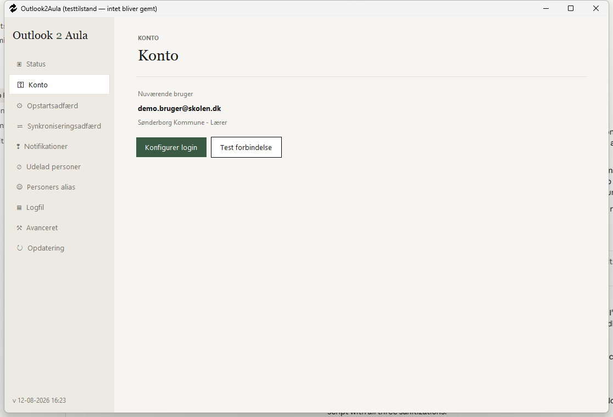
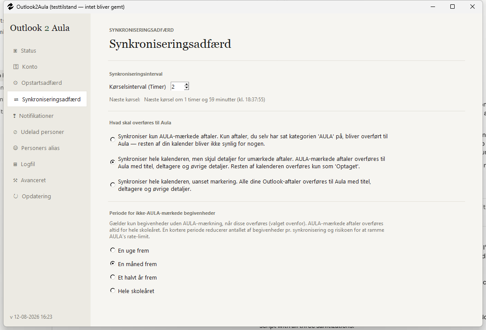
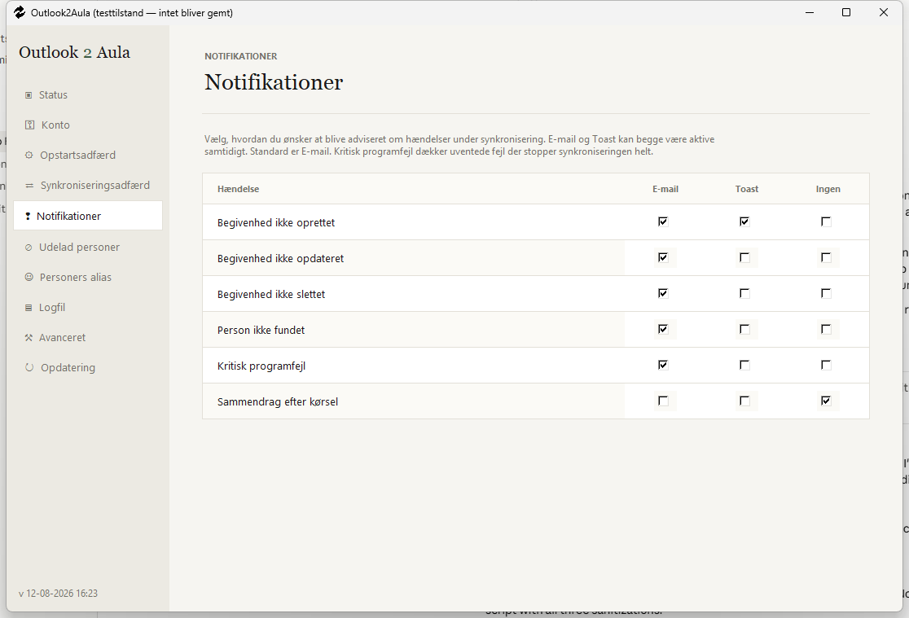
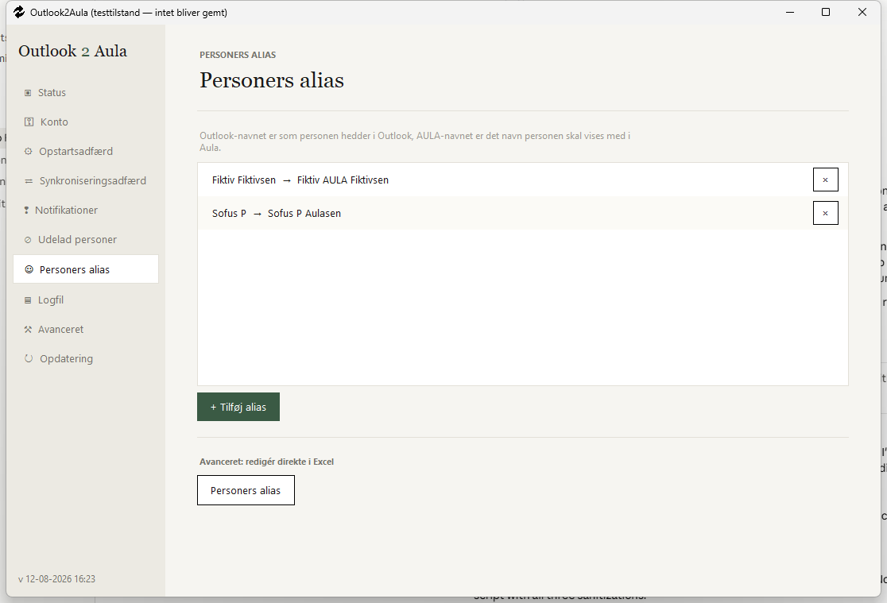
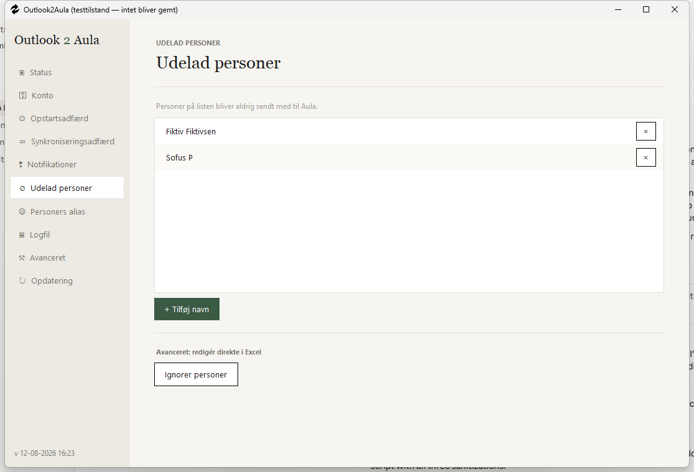
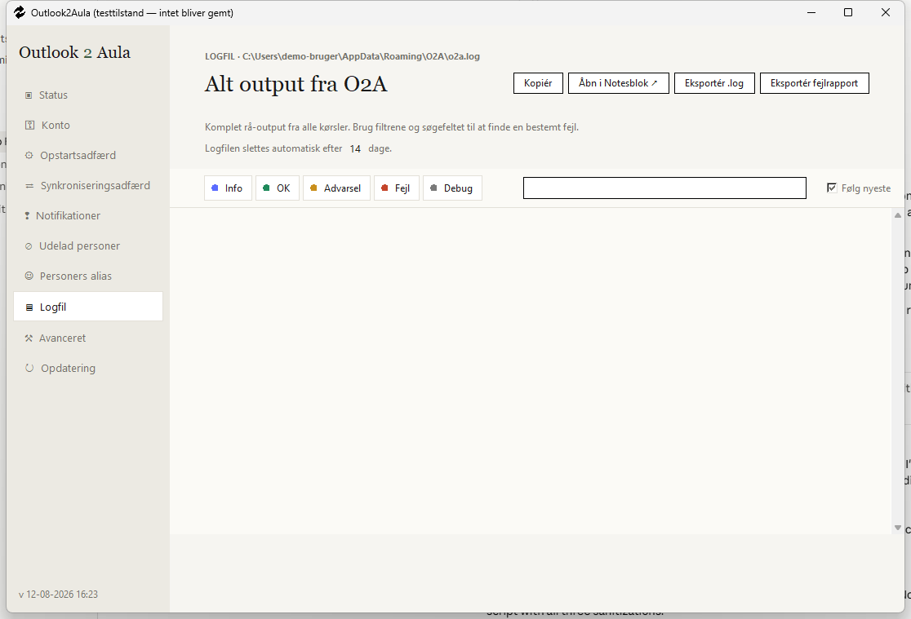
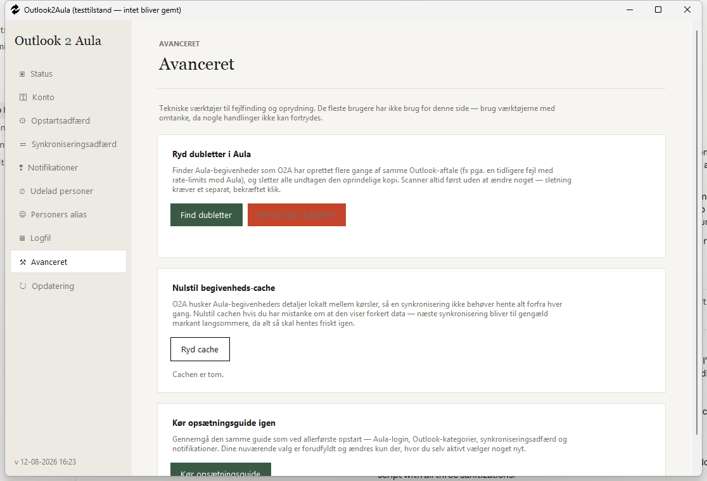

# Outlook2Aula (O2A)

Et grafisk Windows-program, der automatisk synkroniserer din Outlook-kalender med Aula. Du opretter og redigerer aftaler i Outlook som du plejer, mærker dem med kategorien **"AULA"**, og O2A sørger for resten — synkroniseringen går kun én vej, fra Outlook til Aula.

Dette er den grafiske overbygning til det oprindelige "[O2A script](https://github.com/froksen/O2A)".

## Indhold

- [Hvordan virker det](#hvordan-virker-det)
- [Skærmbilleder](#skærmbilleder)
- [Funktioner](#funktioner)
- [Begrænsninger](#begrænsninger)
- [Tekniske krav](#tekniske-krav)
- [Opsætning og afvikling](#opsætning-og-afvikling)

## Hvordan virker det

Når en aftale oprettes eller ændres i Outlook, tilføjer du kategorien "AULA" til den. Når O2A herefter kører (automatisk med et valgfrit interval, eller manuelt via "Synkronisér nu"), sker følgende:

1. **Login til Aula** — programmet logger ind via UNI-login med dine gemte loginoplysninger.
2. **Outlook-kalenderen læses** — via Windows COM-integration, kun aftaler mærket "AULA" eller "AULA Institutionskalender" (eller hele kalenderen, afhængig af din indstilling — se [Synkroniseringsadfærd](#synkroniseringsadfærd)).
3. **Aula-kalenderen hentes** — via Aulas API, og O2A genkender sine egne tidligere oprettede aftaler.
4. **De to kalendere sammenlignes** — nye aftaler oprettes i Aula, ændrede aftaler opdateres, og aftaler du har slettet i Outlook fjernes igen fra Aula.
5. **Resultatet logges** — i programmets statusvisning, og eventuelt som e-mail eller Windows-notifikation, alt efter dine notifikationsindstillinger.

Det er altid Outlook, der bestemmer — det er en envejssynkronisering, og ændringer foretaget direkte i Aula bliver overskrevet ved næste kørsel.

## Skærmbilleder

<table>
<tr>
<td width="50%">

**Status** — se resultatet af seneste synkronisering, kør en manuel synkronisering, eller forhåndsvis ændringer før de sendes.

</td>
<td width="50%">

**Konto** — se og skift den Aula-konto O2A synkroniserer med.

</td>
</tr>
<tr>
<td width="50%">

**Synkroniseringsadfærd** — vælg kørselsinterval, og hvor meget af kalenderen der skal overføres.

</td>
<td width="50%">

**Notifikationer** — vælg pr. hændelsestype om du vil adviseres via e-mail, Windows-notifikation, ingen af delene.

</td>
</tr>
<tr>
<td width="50%">

**Personers alias** — oversætter et Outlook-navn til det navn, personen skal vises med i Aula.

</td>
<td width="50%">

**Udelad personer** — navne på listen bliver aldrig sendt med til Aula.

</td>
</tr>
<tr>
<td width="50%">

**Logfil** — komplet, søgbart output fra alle kørsler, med filtrering pr. niveau.

</td>
<td width="50%">

**Avanceret** — tekniske værktøjer: dublet-oprydning i Aula, nulstilling af begivenheds-cache, og genkørsel af opsætningsguiden.

</td>
</tr>
</table>

## Funktioner

- Oprette, opdatere og slette heldags- og tidsafgrænsede begivenheder i Aula ud fra Outlook
- Tilføje deltagere fra Outlook-begivenheden til Aula-begivenheden, når de findes på samme institution som dig selv
- Tre niveauer af synkroniseringsadfærd:
  - **Kun AULA-mærkede aftaler** — resten af kalenderen forbliver privat
  - **Hele kalenderen, med skjulte detaljer for umærkede aftaler** — de vises kun som "Optaget" i Aula
  - **Hele kalenderen, uanset markering** — alt overføres med fulde detaljer
- Navne-alias, så et Outlook-navn kan vises med et andet navn i Aula
- En udelad-liste, så bestemte personer aldrig sendes med til Aula
- Forhåndsvisning af ændringer, før de rent faktisk sendes til Aula
- Fleksible notifikationer (e-mail og/eller Windows-notifikation) pr. hændelsestype: mislykket oprettelse/opdatering/sletning, person ikke fundet, kritisk programfejl, eller et sammendrag efter hver kørsel
- Automatisk kørsel i et valgfrit interval (1-4 timer), med mulighed for at sætte den på pause
- Kørsel i baggrunden via systembakken, med genvej til status, indstillinger og manuel synkronisering
- Dublet-oprydning: finder og fjerner Aula-begivenheder som O2A ved en fejl har oprettet flere gange
- Automatisk opdatering af programmet via Git
- Dansk sommer-/vintertid beregnes dynamisk, så programmet ikke er afhængigt af en manuelt vedligeholdt tabel

## Begrænsninger

- **Kun Windows** — kræver Microsoft Outlook installeret lokalt.
- **Ingen tovejssynkronisering** — ændringer foretaget direkte i Aula kan blive overskrevet ved næste kørsel.
- **Gentagne begivenheder synkroniseres ikke korrekt** som ægte tilbagevendende Aula-begivenheder.
- **Vedhæftede filer/medier overføres ikke** fra Outlook til Aula.
- **Frister, påmindelser m.v. overføres ikke.**
- **Kun ca. et år frem** — begivenheder synkroniseres kun frem til cirka ét år fra dags dato.

## Tekniske krav

- Windows med Microsoft Outlook installeret
- Python 3 (se [Requirements.txt](Requirements.txt), som lister afhængighederne)
- (Anbefales) Git, bruges til at holde programmet opdateret

## Opsætning og afvikling

### Med Git installeret (anbefalet)

1. Hent seneste udgave af projektet fra GitHub.
2. Åbn mappen i Stifinder og kør `updateandrun.bat`. Denne fil opdaterer koden (via Git), installerer/opdaterer afhængigheder (via pip), og starter programmet.

### Uden Git installeret

1. Hent seneste udgave af projektet fra GitHub.
2. Installer afhængighederne: `pip install -r Requirements.txt`
3. Start programmet ved at dobbeltklikke på `main.pyw`, eller kør `python main.pyw`.

Ved første opstart guider en opsætningsguide dig igennem Aula-login, Outlook-kategorier, synkroniseringsadfærd og notifikationer. Guiden kan køres igen når som helst fra **Avanceret → Kør opsætningsguide igen**.

Når programmet kører, ligger det i Windows-systembakken. Herfra kan du åbne vinduet, synkronisere manuelt, eller sætte automatisk kørsel på pause.
